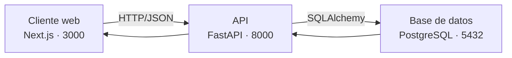

# Arquitectura del proyecto

> Entregable 4 de la Guía de Laboratorio Nº 01 — Integración tecnológica.

---

## 1. Estructura de carpetas

```
proyecto-software-agil/
├── backend/          # API FastAPI (Python)
├── frontend/         # Interfaz Next.js (React)
├── docs/             # Documentación del proyecto
│   ├── comparativa.md
│   ├── manifiesto.md
│   └── arquitectura.md
├── .gitignore
└── README.md
```

---

## 2. Esquema preliminar

```
┌──────────────────────┐   HTTP/JSON   ┌──────────────────────┐   SQLAlchemy   ┌──────────────────────┐
│     Cliente web      │ ────────────► │         API          │ ─────────────► │   Base de datos      │
│  Next.js (puerto     │               │  FastAPI (puerto     │                │  PostgreSQL          │
│  3000)               │ ◄──────────── │  8000)               │ ◄───────────── │  (puerto 5432)       │
└──────────────────────┘               └──────────────────────┘                └──────────────────────┘
   Presentación                            Lógica de negocio                       Persistencia
```



| Capa | Tecnología | Responsabilidad |
|---|---|---|
| Presentación | Next.js | Renderizar la interfaz y consumir la API mediante peticiones HTTP/JSON. |
| Lógica de negocio | FastAPI | Exponer endpoints REST, validar datos, aplicar reglas de negocio y autenticación. |
| Persistencia | PostgreSQL | Almacenar productos, usuarios, carritos y pedidos de forma transaccional. |

---

## 3. ¿Por qué esta arquitectura se beneficia más de un enfoque ágil que de uno tradicional?

**1. Separación por capas.** El frontend, la API y la base de datos son independientes y se comunican por contratos (endpoints JSON). Se puede evolucionar una capa sin reescribir las demás: rediseñar la interfaz no obliga a tocar la lógica de la API. Esa independencia es justamente lo que permite iterar por partes en lugar de avanzar en bloque.

**2. Entregas incrementales.** Cada funcionalidad atraviesa las tres capas de forma completa y acotada (tabla + endpoint + pantalla). Es posible construir y demostrar "productos", luego "usuarios", luego "ventas" — cada Sprint entrega una porción utilizable en vez de una fase intermedia que nadie puede probar.

**3. Adaptación rápida al cambio.** Si aparece un requisito nuevo, se agrega un endpoint y su pantalla correspondiente sin alterar el resto del sistema. En cascada, ese mismo cambio obligaría a revisar el documento de diseño global y replanificar las fases restantes.

**4. Pruebas continuas.** Al tener componentes desacoplados se puede probar cada uno por separado —tests unitarios en la API, tests de interfaz en el frontend— a medida que se construyen, en lugar de concentrar toda la verificación en una fase final de pruebas.

**5. Menor riesgo acumulado.** Si una funcionalidad se cancela o cambia de dirección, el resto del sistema sigue operando y el trabajo previo no se pierde. El riesgo se distribuye entre los Sprints en lugar de concentrarse en la entrega final.

**En resumen:** una arquitectura desacoplada por capas hace que el cambio sea barato y que el valor se pueda entregar por partes. Esas dos propiedades son precisamente las que un enfoque ágil aprovecha y las que un enfoque en cascada desaprovecha.
